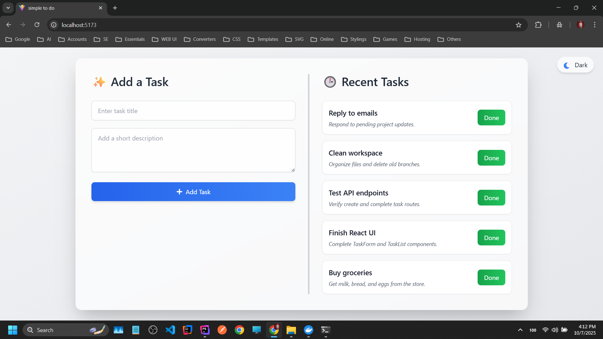
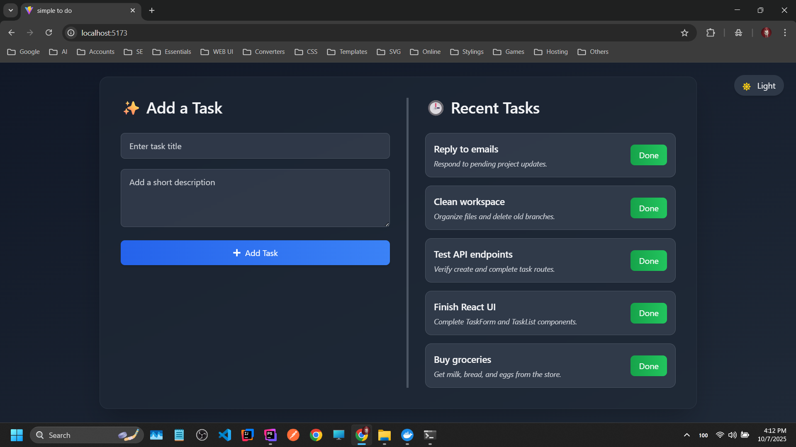
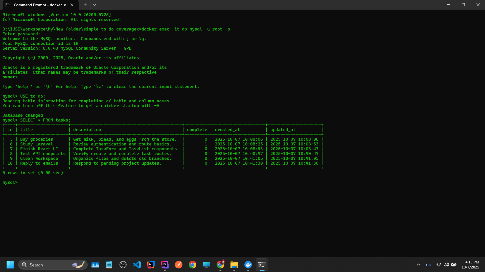
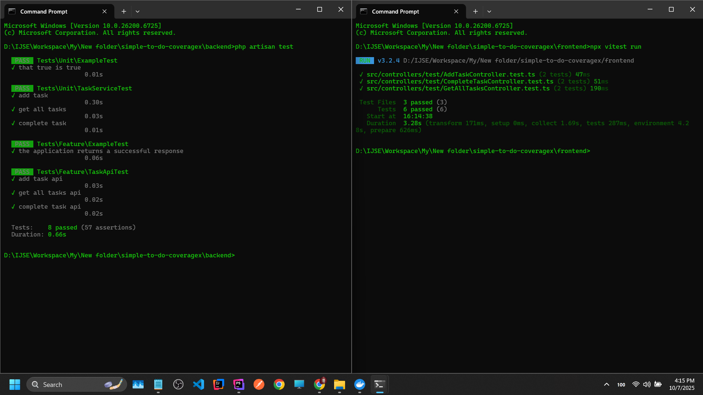

# 🌟 Simple TO-DO (Laravel + React) 🌟

Welcome to **Simple TO-DO**, a lightweight task management application built with **Laravel**(backend) and **React**(
frontend). This project demonstrates how to combine a Laravel API with a React UI for creating, reading, updating, and
deleting tasks in a simple and clean way.

## 🛠️ Tech Stack

### 🔥 Frontend

✅ React<br/>
✅ Vite<br/>
✅ Typescript<br/>
✅ Tailwind CSS<br/>

### 🔥 Backend

✅ Laravel<br/>
✅ PHPUnit<br/>
✅ MySQL<br/>

## 🚀 Features

✅ Add new tasks<br/>
✅ View all tasks<br/>
✅ Mark tasks as completed<br/>
✅ Persistent storage with MySQL<br/>
✅ Clean and modern UI with Tailwind<br/>

## ▶️ How to Run the Project

1. Clone the repository:
    ```bash
    git clone https://github.com/Kavithma-Thushal/simple-to-do-coveragex.git

2. Install dependencies:

* Frontend
  ```bash
  cd frontend
  npm install

* Backend
  ```bash
  cd backend
  composer install

3. Open `Docker Desktop` Software on your machine.

4. Open a terminal in the `Project Root` directory.

5. Build and start the containers:
   ```bash
   docker-compose up --build

6. Open your browser and access:
    ```bash
    http://localhost:5173

7. ✅ You’re all set! Add, view, and manage your tasks easily!

## 🐬 How to Access the MySQL Database (Docker)

1. Open a terminal in the `Project Root` directory.

2. Run this command to enter the MySQL container:
    ```bash
   docker exec -it db mysql -u root -p

3. Enter the password:
    ```bash
   1234

4. Select the database:
    ```bash
   USE to-do;

5. View tasks table:
    ```bash
   SELECT * FROM tasks;

## 🧪 How to test

* Frontend
    ```bash
  cd frontend
  npx vitest run

* Backend
    ```bash
  cd backend
  php artisan test

## 🔗 API Endpoints (Laravel)

✅ POST /api/task/add<br/>
✅ GET /api/task/getAll<br/>
✅ PATCH /api/task/complete<br/>

## 📸 Screenshots

### Frontend-Light



### Frontend-Dark



### MySQL DB



### Tests



## 📬 Get in Touch

Got any bugs, issues, or need help understanding the code? Feel free to reach out!

📧 [kavithmathushal9007@gmail.com](mailto:kavithmathushal9007@gmail.com)

<div align="center">

#### This project is licensed under the [GNU License](LICENSE)

#### © 2025 All Rights Reserved | Designed by [Kavithma Thushal](https://github.com/Kavithma-Thushal)

</div>